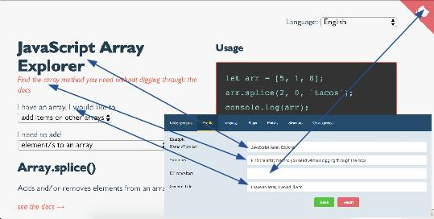
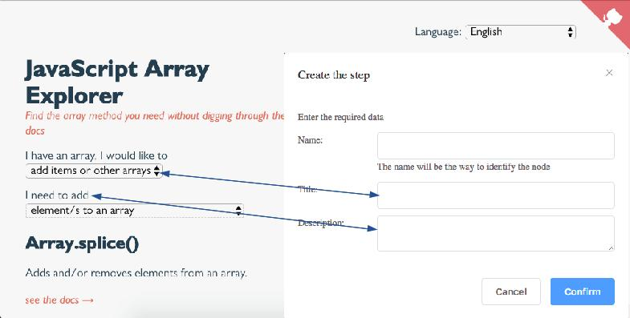
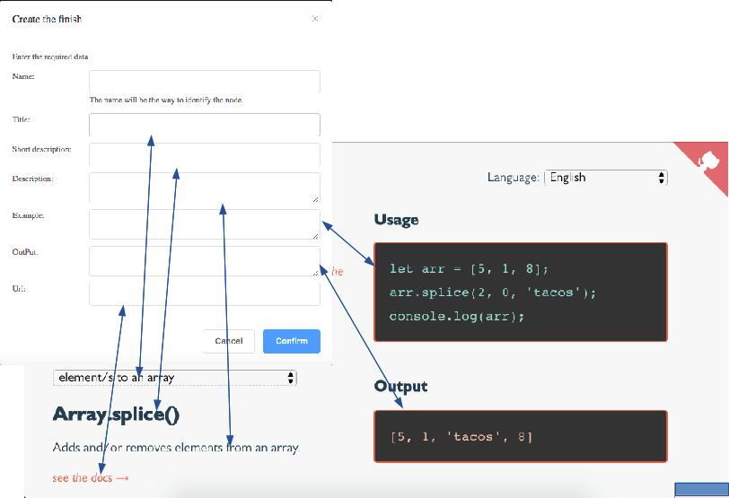

# Helper

#### Status: Alpha version

> Basado en la idea de Sarah Drasner (@sdras). Un ejemplo de la creación de Sarah Drasner a la que se hace referencia:  [JavaScript Array Explorer](https://codepen.io/sdras/full/gogVRX/). Mas información en history-es.md

## Idea

La idea principal es poder crear un sistema de ayuda sencillo e intuitivo. El sistema da las herramientas para seguir el formato creado por Sarah Drasner en sus ejemplos.

## Iniciar el sistema

Dos terminales deben ser abiertos para poder operar el sistema:
Terminal 1:

``` bash
# entrar al servidor interno de archivos
cd src
cd internalServer

# instalar dependencias
npm install

# inicia el servidor de archivos en http://localhost:5000
npm start
```
Terminal 2:
``` bash
# instalar dependecias
npm install

# servidor con reload automatico si cambia el codigo en localhost:8000
npm run dev
```

## Como usar el producto

Si se han seguido las instrucciones, la segunda terminal lanza el servicio en http://localhost:8000

El sistema cuenta con dos projectos de los que luego se hablara aquí. Para comenzar a crear se debe ir a la siguiente url: http://localhost:8000/admin

Comienza un menu de 7 opciones:

#### List of projects:

Aqui se crean los nuevos proyectos, se eliminan, renombran o seleccionan.

El nombre de cada proyecto debe ser una palabra única

#### Profile

Hagamos una comparacion grafica del producto original para entender los campos



El vinculo a github aun no ha sido desarrollado

#### Language

Contiene los lenguajes extras para el proyecto ademas de ingles. Solo se crean las carpetas y las relaciones de contenidos correspondientes pero no hay traduccion automática.

En principio todos los contenidos son en ingles y deben ser traducidos manualmente.

#### Antes de continuar

El sistema se divide en 3 elementos.
**Step**: titulo y descripcion. Puede tener descendencia
**Finish**: Contiene informacion variada y no puede contener hijos. Es la respuesta definitiva luego de varios Steps.
**Structure**: Establece en forma de arbol las relaciones de contenido

#### Continuando con el menu Steps:

Cada step tiene 3 campos: 

* Name: Debe ser unico e irrepetible. No se debe traducir. No lo ve el usuario

  Los otros dos se explican de forma gráfica:



Cada steps puede contener tantos steps o finish como necesite. No hay limite de recursividad.

Lo logico es que al final se llegue a un finish.

####  finish

Finish tiene varios campos. 

* Name: Unico, Irrepetible. No se puede traducir. No lo ve el usuario

  Los otros los veremos de forma gráfica



Los finish no pueden tener descendencia.

#### Structure

Es donde se establece el orden de presentacion de los steps y finish creados. Se usa un formato de arbol para ello.

#### Create project

Este es el ultimo paso para crear el proyecto. Sobre los productos creados y sus dependencias leer: ProyectDependencies-es.md

Una vez el proyecto ha sido creado, usted puede acceder http://localhost:8000/ y acceder a una lista de projectos creados para usar.

Para extraer el producto creado hacia otro proyecto lea: Extractfinalproduct-es.md

#### Desarrollo

Si desea conocer mas sobre el codigo o los procesos internos del sistema lea: Developers-es.md

#### Example y Default

El sistema ofrece un ejemplo basado en la creacion de Sarah Drasner ya terminado y disponible para la modificacion a en `Admin` o como uso de pruebas en `/`.

The system brings an example based on Sarah Drasner's creation already finished and available for modification in `Admin` or its use of tests in `/`.

`Default` on the contrary is the basis of creations. Any change to default will be inherited by subsequent projects.