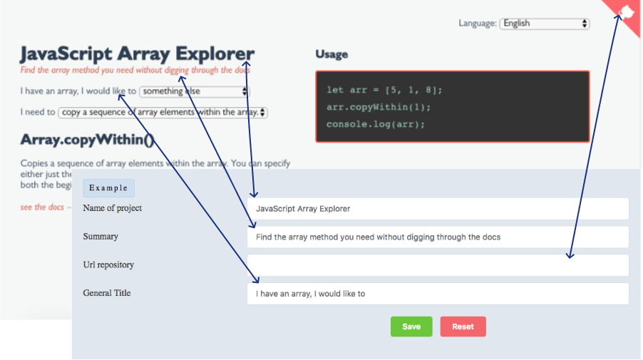
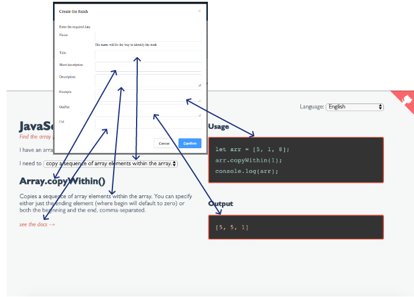

# SDras Helper
[](https://www.codacy.com/app/godan2310/SDras-Helper?utm_source=github.com&amp;utm_medium=referral&amp;utm_content=Gonzalo2310/SDras-Helper&amp;utm_campaign=Badge_Grade)

#### Status: Alpha version

> Basado en la idea de Sarah Drasner (@sdras). Un ejemplo de la creación de Sarah Drasner a la que se hace referencia:  [JavaScript Array Explorer](https://codepen.io/sdras/full/gogVRX/). Mas información en history-es.md

## Idea

La idea principal es poder crear un sistema de ayuda sencillo e intuitivo. El sistema da las herramientas para seguir el formato creado por Sarah Drasner en sus ejemplos.

## Iniciar el sistema

Dos terminales deben ser abiertos para poder operar el sistema:

Terminal 1:

``` bash
# entrar al servidor interno de archivos
cd src
cd internalServer

# instalar dependencias
npm install

# inicia el servidor de archivos en http://localhost:5000
npm start
```
Terminal 2:
``` bash
# instalar dependecias
npm install

# servidor con reload automatico si cambia el codigo en localhost:8000
npm run dev
```

## Como usar el producto

Si se han seguido las instrucciones, la segunda terminal lanza el servicio en http://localhost:8000/#/

El sistema cuenta con dos projectos de los que luego se hablara aquí. Para comenzar a crear se debe ir a la siguiente url: http://localhost:8000/#/admin

Comienza un menu de 7 opciones:

#### List of projects:

Aqui se crean los nuevos proyectos, se eliminan, renombran o seleccionan.

El nombre de cada proyecto debe ser una palabra única

#### Profile

Hagamos una comparacion grafica del producto original para entender los campos



El vinculo a github aun no ha sido desarrollado

#### Idiomas

Contiene los idiomas extras para el proyecto ademas de ingles. Solo se crean las carpetas y las relaciones de contenidos correspondientes pero no hay traduccion automática.

En principio todos los contenidos son en ingles y deben ser traducidos manualmente.

Mas informacion de idiomas en language-es.md

#### Antes de continuar

El sistema se divide en 3 elementos.
**Step**: titulo y descripcion. Puede tener descendencia
**Finish**: Contiene información variada y no puede contener hijos. Es la respuesta definitiva luego de varios Steps.
**Structure**: Establece en forma de arbol las relaciones de contenido

#### Continuando con el menu Steps:

Cada step tiene 3 campos: 

* Name: Debe ser unico e irrepetible. No se debe traducir. No lo ve el usuario

  Los otros dos se explican de forma gráfica:


Cada steps puede contener tantos steps o finish como necesite. No hay limite de recursividad.

Lo logico es que al final se llegue a un finish.

####  finish

Finish tiene varios campos. 

* Name: Unico, Irrepetible. No se puede traducir. No lo ve el usuario

  Los otros los veremos de forma gráfica



Los finish no pueden tener descendencia.

#### Structure

Es donde se establece el orden de presentacion de los steps y finish creados. Se usa un formato de arbol para ello.

#### Create project

Este es el ultimo paso para crear el proyecto. Sobre los productos creados y sus dependencias leer: ProyectDependencies-es.md

Una vez el proyecto ha sido creado, usted puede acceder http://localhost:8000/#/ y acceder a una lista de projectos creados para usar.

Para extraer el producto creado hacia otro proyecto lea: Extractfinalproduct-es.md

#### Desarrollo

Si desea conocer mas sobre el codigo o los procesos internos del sistema lea: Developers-es.md

#### Example y Default

El sistema ofrece un ejemplo basado en la creacion de Sarah Drasner ya terminado y disponible para la modificacion a en `Admin` o como uso de pruebas en `/`.

`Default`  por el contrario, es la base de las creaciones. Cualquier cambio en el valor predeterminado será heredado por proyectos posteriores.

#### Collaboradores 

*  [Juan Manuel Cruz (Malows)](https://github.com/Malows)
*  [Daniel Primo (delineas)](https://github.com/delineas) 
*  [PabloJS](https://github.com/PabloJS) 
*  [Alexandre Ballesté (sinmsinm)](https://github.com/sinmsinm) 
*  [Laura Santana (LalyStana)](https://github.com/LalyStana)

#### Creado por 
 [Gonzalo Nandez (Gonzalo2310)](https://github.com/Gonzalo2310)

#### Inspirado en una idea de:
 [Sarah Drasner (sdras)](https://github.com/sdras)